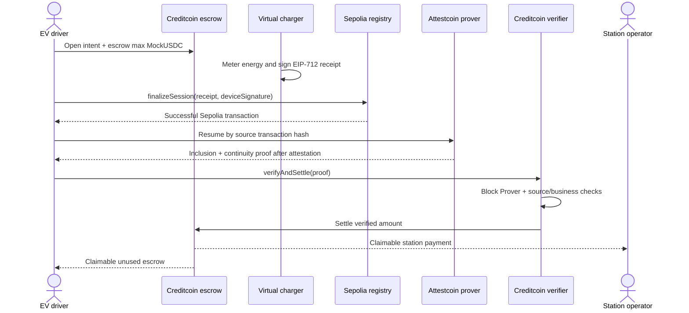

# ChargeProof

> Trustless cross-chain EV charging settlement.

ChargeProof is a DePIN settlement protocol where an EV driver escrows demo USDC on Creditcoin
Testnet, a charger anchors a device-signed session on Ethereum Sepolia, and the operator is paid
only after Creditcoin's Attestcoin Protocol verifies that exact source transaction. The unused
escrow is credited back to the driver.

**Hackathon:** BUIDL CTC 2026 Fall — “BUIDL For The Real World”<br>
**Track:** DePIN<br>
**Status:** the project-owned Sepolia-to-Creditcoin Gate 2 flow is live and explorer-verifiable. A
real Attestcoin proof settled one funded intent, and a mined replay attempt reverted as designed.
Official-example Gate 1 evidence remains clearly separated from ChargeProof-owned evidence. The
DoraHacks BUIDL submission was completed on 2026-08-27.

**Submission deck:** [ChargeProof-Deck.pdf](submission/ChargeProof-Deck.pdf)

**Demo video:** [ChargeProof — Trustless Cross-Chain EV Charging Settlement](https://youtu.be/ezp9PUCCaRI)

**DoraHacks BUIDL:** [dorahacks.io/buidl/48131](https://dorahacks.io/buidl/48131)

**Live demo:** [chargeproof-plum.vercel.app](https://chargeproof-plum.vercel.app) — configured for the
project-owned Sepolia and Creditcoin Testnet deployments and seeded with a clearly labeled previous
real settlement.

## Judge fast path — no keys required

The hosted dashboard exposes the project-owned source, settlement, and rejected-replay transactions
before any wallet interaction. To independently re-read all five deployed contracts, transaction
statuses, settled accounting, station metrics, and replay marker—and then exercise the local vertical
slice—run:

```bash
pnpm install --frozen-lockfile
pnpm judge:verify
```

This command is read-only on public testnets. It never requests a wallet or private key. RPC checks
retry transient failures and use the public Creditcoin Blockscout RPC as a fallback to the official
testnet endpoint. The local integration portion is explicitly a simulation and mocks only the native
`0x0FD2` boundary.

## The real-world problem

EV roaming joins drivers, charge point operators, mobility providers, and payment rails that do not
share one ledger. A source-chain event alone cannot release funds on another chain: the destination
needs an authenticated, replay-safe fact about the source transaction, plus business validation of
what that transaction means.

ChargeProof narrows that problem to one auditable primitive: **pay a registered station only when a
successful, canonical, device-signed charging receipt matches a funded intent.** It is useful beyond
EV charging wherever metered infrastructure produces signed usage receipts.

## Why Attestcoin is essential

The escrow contract cannot read Sepolia. Attestcoin supplies the cryptographic inclusion and
continuity proof that lets Creditcoin verify the source transaction through its native Block Prover.
Without Attestcoin, a relayer could invent or alter the transaction bytes, and the settlement path
cannot run. ChargeProof does not treat inclusion as sufficient: it revalidates the receipt status,
sender, contract, selector, calldata, device signature, intent, price, expiry, and replay keys on
Creditcoin.

Attestcoin does **not** prove physical electricity delivery. In this MVP, an authorized burner device
key represents the charger hardware boundary. Secure elements, OCPP/OCPI integration, hardware
attestation, and independent meter corroboration are production roadmap items.

## Architecture



| Layer      | Component                         | Responsibility                                                                 |
| ---------- | --------------------------------- | ------------------------------------------------------------------------------ |
| Sepolia    | `ChargingSessionRegistry`         | Canonical selector, device EIP-712 validation, session/nonce replay prevention |
| Attestcoin | SDK + proof service + `0x…0FD2`   | Source transaction inclusion and chain continuity verification                 |
| Creditcoin | `AttestcoinChargeVerifier`        | Decode verified EVM transaction and revalidate every settlement invariant      |
| Creditcoin | `ChargeIntentEscrow`              | Hold max payment, record outcome, expose pull-based payment/refund claims      |
| Creditcoin | `StationRegistry`                 | Snapshot payout/device identity and maintain explainable settlement metrics    |
| Web/worker | Next.js dashboard + resumable CLI | Device simulation, wallet flow, persisted proof lifecycle, diagnostics         |

See [Architecture](docs/ARCHITECTURE.md) and the exact
[Attestcoin integration](docs/ATTESTCOIN_INTEGRATION.md).

## End-to-end flow

1. Connect to Creditcoin Testnet, mint demo `MockUSDC`, approve the escrow, and open an intent.
2. Run the explicitly labeled virtual charger. Energy, duration, tariff, and amount remain visible.
3. A server-held burner device key signs the deterministic receipt; the driver submits it to the
   canonical Sepolia registry.
4. Resume the attestation worker by source hash. It confirms mining, waits for both on-chain and
   prover heights, generates a proof with `@gluwa/usc-sdk`, and checks the live Block Prover.
5. Anyone can submit the proof. Creditcoin verifies and settles atomically, recording station credit,
   driver refund credit, metrics, and replay markers.
6. The operator and driver withdraw their own claims. A failed transfer cannot revert settlement.

## Live evidence and contracts

ChargeProof deployment metadata and the generated Gate 2 result are machine-readable in
[`deployments/`](deployments).

| Evidence                                                       | Status               | Link                                                                                                                               |
| -------------------------------------------------------------- | -------------------- | ---------------------------------------------------------------------------------------------------------------------------------- |
| ChargeProof Sepolia registry                                   | Source verified      | [`0x1F4E…56fc`](https://sourcify.dev/server/repo-ui/11155111/0x1F4E029B8e1FD4291fB96F64C3f12529F1f756fc)                           |
| Creditcoin escrow                                              | Source verified      | [`0x39349C…B988`](https://creditcoin-testnet.blockscout.com/address/0x39349C8539055C3E6fc637651d4Fe3373E3dB988#code)               |
| Creditcoin Attestcoin verifier                                 | Source verified      | [`0xA205b6…dEf3`](https://creditcoin-testnet.blockscout.com/address/0xA205b6d1BD09ACB1b9575A98a942aCbcFF3CdEf3#code)               |
| Funded Creditcoin intent                                       | Success              | [`0xb9e39a…f871`](https://creditcoin-testnet.blockscout.com/tx/0xb9e39a6377a1f491e83b70d6673243cc7093f0d3cf83d9ade015f8ee9583f871) |
| Device-signed ChargeProof source receipt                       | Success              | [`0x5c7eed…0938`](https://sepolia.etherscan.io/tx/0x5c7eed57e460be3741746ab469527361fd3f50fe63cd28c07733de0dbfa50938)              |
| Custom Attestcoin proof                                        | Verified live        | 2,336 encoded bytes, 7 Merkle siblings, 7 continuity roots; `verifySingle = true`                                                  |
| ChargeProof settlement                                         | Success              | [`0xc7ad38…514b`](https://creditcoin-testnet.blockscout.com/tx/0xc7ad38e06f6462ab880ea638ae9205081435ed89a76581ad66067acb4436514b) |
| Duplicate proof replay                                         | Reverted as expected | [`0xb9155e…daff`](https://creditcoin-testnet.blockscout.com/tx/0xb9155eb1eaaf8bee27c1ce6fd55008442d17c006bfa65240f33513467161daff) |
| Hosted dashboard                                               | Live testnet         | [Vercel production deployment](https://chargeproof-plum.vercel.app)                                                                |
| Official Attestcoin example source transaction used for Gate 1 | Attributed           | [Sepolia transaction](https://sepolia.etherscan.io/tx/0xce785c35e300d607d83da9564990c4d2aaf45dafc68ef76539d97aee3de6859b)          |

The custom proof settled 1.47 MockUSDC to the station, credited a 3.53 MockUSDC driver refund, and
recorded 4,200 Wh. The final row is official-example scaffolding, not project-owned evidence. See
[submission/EVIDENCE.md](submission/EVIDENCE.md) for the strict attribution boundary.

## Security model

- Source chain key, source registry, function selector, successful receipt status, and recovered
  source sender are checked from Attestcoin-verified transaction bytes.
- The same EIP-712 device signature and deterministic pricing/session formula are verified on both
  chains.
- Intent parameters snapshot the operator payout and device signer, avoiding mutable-registry races.
- Receipt start time must follow intent creation within a five-minute cross-chain clock tolerance.
- Three replay domains protect source transaction position, intent settlement, and session ID.
- Escrow uses `SafeERC20`, checks-effects-interactions, `ReentrancyGuard`, and pull payments.
- The verifier and station metrics recorder are one-time bindings; there is no proxy or upgrade path.
- Expired intents become refundable only after a 30-minute attestation grace period.

Read the complete [threat model](docs/THREAT_MODEL.md) before treating this MVP as production-ready.

## Local setup

Requirements: Node.js 24.x, pnpm 11, and Git. No private key is required for local tests.

```bash
pnpm install --frozen-lockfile
pnpm compile
pnpm test
pnpm typecheck
pnpm lint
pnpm build
pnpm secret:scan
pnpm --filter @chargeproof/web dev
```

Copy `.env.example` to a local `.env.local` only when using testnets. Never commit it. See
[Local development](docs/LOCAL_DEVELOPMENT.md) for the local simulation and
[Testnet deployment](docs/TESTNET_DEPLOYMENT.md) for burner-wallet steps.

For a new dedicated testnet burner set, `pnpm wallets:create` writes only Git-ignored environment
files and prints public addresses only. `pnpm wallets:status` performs a read-only balance check.

## Environment configuration

Public defaults cover RPC, explorers, chain IDs, chain key `1`, proof service, and Block Prover
`0x0000000000000000000000000000000000000FD2`. Deployment addresses remain blank until deployed.
Private variables are deliberately server/CLI-only:

- `SEPOLIA_DEPLOYER_PRIVATE_KEY`
- `CREDITCOIN_DEPLOYER_PRIVATE_KEY`
- `DEVICE_SIMULATOR_PRIVATE_KEY`
- `CREDITCOIN_SETTLER_PRIVATE_KEY` (optional because proof submission is permissionless)

Use dedicated testnet-only wallets. Never paste a key into chat, frontend code, logs, or Git.

After the dedicated deployer has gas on both testnets, the recommended resumable project-owned flow
is `pnpm testnet:gate2`. It deploys both stacks idempotently, opens the intent, anchors the signed
receipt, waits for Attestcoin, settles, submits an expected-failing replay, and writes public results
to `deployments/gate2-evidence.json`. It never prints or persists either private key.

## Test and quality commands

```bash
pnpm format:check
pnpm lint
pnpm typecheck
pnpm compile
pnpm test
pnpm build
pnpm secret:scan
pnpm evidence:verify
pnpm proof:resume -- 0xSOURCE_TRANSACTION
pnpm wallets:status
# Credentialed and state-changing on testnets only:
pnpm testnet:gate2
```

`docs/BUILD_STATUS.md` records commands actually run. Mocked unit tests replace only the native
precompile boundary; live protocol evidence is labeled separately.

## Known limitations

- The charger is a hardware simulator, not a connected physical EVSE.
- Device authorization is owner-managed and centralized for the MVP.
- A new interactive live run requires testnet gas and a browser wallet; the seeded historical
  settlement remains independently verifiable without either.
- RPC and proof services are external availability dependencies; the worker persists progress and can
  resume, but cannot make a stalled attestation advance.
- `MockUSDC` has no monetary value and is not production collateral.

More detail: [Known limitations](docs/KNOWN_LIMITATIONS.md).

## Roadmap

The next production stages are secure-element device keys, OCPP 2.0.1/ISO 15118 receipt ingestion,
multi-operator onboarding, decentralized device attestation, stablecoin/payment-provider integration,
observability, audits, and a CEIP proposal covering reusable metered-infrastructure settlement. The
same receipt-proof-escrow primitive can serve solar microgrids, telecom hotspots, and other measured
DePIN services. See [CEIP roadmap](docs/CEIP_ROADMAP.md).

## Repository map

```text
apps/web                         One-page dashboard and device-signing boundary
services/attestation-worker      Idempotent proof lifecycle CLI/service
packages/contracts-sepolia       Canonical charging-session source contract
packages/contracts-creditcoin    Verifier, escrow, station registry, MockUSDC
packages/shared                  Chain constants, ABI, EIP-712 receipt helpers
deployments                      Machine-readable testnet metadata
docs                             Research, architecture, security, operations
submission                       Judge copy, deck, video, evidence, checklist
```

## License

MIT. See [LICENSE](LICENSE).
