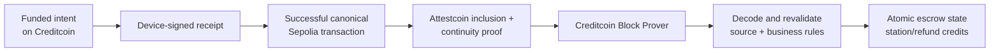

# Architecture

## Design goal

ChargeProof implements one narrow cross-chain state transition: convert a successful,
device-authorized Sepolia charging-session transaction into bounded station payment and driver
refund credits on Creditcoin Testnet. The destination never accepts a relayer assertion by itself.

## Components

### `ChargingSessionRegistry` — Ethereum Sepolia

The canonical source contract exposes one `finalizeSession(ChargingReceipt,bytes)` entry point. It
requires the driver to be `msg.sender`, verifies the station's current device signer, validates the
EIP-712 signature, derives the session ID, calculates the amount, constrains time, and consumes both
session ID and station nonce. Its successful receipt is the source fact proved by Attestcoin.

### `AttestationWorker` — off-chain, permissionless

The TypeScript worker observes a mined source transaction, checks the canonical target and selector,
reads the current chain mapping and attested heights from Creditcoin, asks the official proof service
for proof material, and verifies it against the live Block Prover before marking it ready. Atomic JSON
state makes each transition resumable by transaction hash. Proof generation and submission are
separate, so no long-lived web request is required.

### `AttestcoinChargeVerifier` — Creditcoin Testnet

The verifier calls the native query verifier at `0x0000000000000000000000000000000000000FD2`.
It reconstructs the transaction index from the Merkle path, verifies inclusion/continuity, and decodes
the RLP transaction/receipt via the official `EvmV1Decoder`. It requires receipt status `1`, exact
source `to`, exact selector, and source sender equal to the receipt driver. Full ABI decoding and
destination-side business checks occur only after proof verification.

### `ChargeIntentEscrow` — Creditcoin Testnet

An intent snapshots the driver, station ID, payout, device signer, maximum payment, tariff, creation
time, expiry, source chain key, and source registry. Settlement credits the final amount and unused escrow in one
state transition. Transfers are deliberately separate pull operations, so a receiver or token failure
cannot roll back a verified settlement.

### `StationRegistry` and `MockUSDC` — Creditcoin Testnet

The registry provides active station configuration when an intent opens, then stores simple aggregate
metrics. The metrics recorder can be bound once. `MockUSDC` is an explicitly valueless six-decimal
demo token with a rate-limited faucet.

## Data model

```text
ChargingReceipt
  intentId       bytes32    joins the two chains
  sessionId      bytes32    keccak256(intentId, stationId, driver, startedAt, nonce)
  stationId      bytes32    operator/device identity
  driver         address    escrow owner and Sepolia transaction sender
  startedAt      uint64     session start, seconds
  endedAt        uint64     session end, seconds
  energyWh       uint64     integer watt-hours
  tariff         uint256    MockUSDC base units per kWh
  finalAmount    uint256    ceil(energyWh * tariff / 1000)
  nonce          uint64     station-device replay domain
  signature      bytes      EIP-712 signature by snapshotted device signer
```

Using watt-hours and token base units avoids floating point. Both chains use OpenZeppelin `Math.mulDiv`
with upward rounding. The client uses the equivalent bigint formula.

## Trust and validation flow



Every arrow is required. Removing the Attestcoin proof disconnects the source transaction from the
destination. Removing destination validation would make successful arbitrary calldata sufficient.
Removing the device signature would make a chain transaction indistinguishable from physical-device
authorization.

## State machines

Intent state is `None -> Open -> Settled` or `None -> Open -> Refunded`. No transition leaves a terminal
state. A refund is allowed only after expiry plus attestation grace, preventing immediate expiry from
racing a normal proof. The verified receipt must start after intent creation, with only five minutes of
cross-chain timestamp tolerance.

Worker state is `DISCOVERING -> MINED -> WAITING_ATTESTATION -> PROOF_READY -> SUBMITTED -> SETTLED`.
Transient RPC/prover errors retain their current state and diagnostics. Deterministic source failures
become terminal `FAILED`.

## Architecture decisions

- **Hardhat 3 only:** it matches the official examples' JavaScript ecosystem and supports a single
  TypeScript test/deploy workflow. Foundry is not duplicated.
- **Solidity 0.8.28:** required by current `@gluwa/usc-contracts` helpers and used consistently.
- **No upgradeability:** immutable verifier/network bindings are more valuable than hackathon-time
  governance flexibility.
- **Permissionless settlement:** proof authenticity is contract-verified; a privileged relayer adds no
  security. Any account can pay target gas.
- **Pull payments:** separates a valid cross-chain decision from unreliable recipient transfers.
- **Client-resumable worker:** attestation latency is incompatible with a single serverless request.

The detailed record is in `docs/decisions/0001-attestcoin-settlement-architecture.md`.
