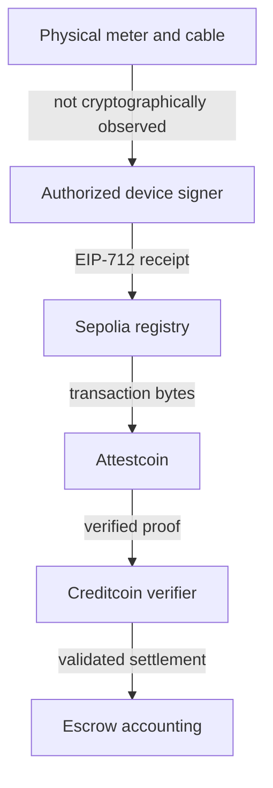

# Threat model

## Scope and assets

Protected assets are escrowed MockUSDC, the driver's refund entitlement, the station operator's
payment entitlement, intent/session uniqueness, station metrics, and the integrity of the evidence
shown to users. Testnet keys and the device signing key are operational secrets even though the token
has no value.

## Actors

- **Driver:** funds an intent and submits the source transaction; may try to underpay, reuse a receipt,
  or refund while a proof is pending.
- **Station operator:** controls payout metadata and may attempt to claim unrelated value.
- **Device signer:** authorizes measured receipt data. Compromise permits false physical claims for
  that station within on-chain limits.
- **Protocol owner:** registers stations and deploys immutable bindings; may misconfigure before an
  intent opens but cannot replace the escrow verifier or metrics recorder later.
- **Permissionless prover/settler:** may submit any proof and pays target gas; receives no privileged
  settlement authority.
- **RPC/proof service:** can be unavailable, stale, or return malformed data, but cannot forge a proof
  accepted by the native Block Prover under the assumed protocol security.
- **Token/recipient:** may revert or reenter during transfers.

## Trust assumptions

1. Creditcoin consensus and the Attestcoin native precompiles are correct.
2. Sepolia consensus produces the successful transaction represented by verified EVM V1 bytes.
3. The registered device private key remains secret and signs honest meter data.
4. The driver and operator inspect intent parameters before signing transactions.
5. Deployed bytecode and constructor parameters match published metadata.

## What Attestcoin guarantees

ChargeProof relies on Attestcoin to authenticate source-chain transaction/receipt data through Merkle
inclusion and attested-chain continuity. The destination checks the proof through the native Block
Prover. This prevents an ordinary relayer from inventing or modifying the source transaction.

Attestcoin does not prove that a physical EV received electricity, that a meter was calibrated, or
that an operator behaved legally. The MVP maps physical authenticity to an authorized device EIP-712
signature. Production requires a secure element, charger-protocol integration, operational identity,
and meter/audit controls.

## Controls by threat

| Threat                         | Control                                                                             |
| ------------------------------ | ----------------------------------------------------------------------------------- |
| Source-chain mismatch          | Immutable chain key; live chain mapping checked by worker                           |
| Wrong source contract          | Immutable registry address; decoded `to` comparison                                 |
| Wrong function/calldata        | Exact selector then full ABI decode; malformed values revert                        |
| Failed source execution        | Decoded receipt status must be `1`                                                  |
| Wrong driver                   | Source `from`, receipt driver, and intent driver must all match                     |
| Wrong station                  | Receipt station must equal snapshotted intent station                               |
| Unauthorized/invalid device    | EIP-712 recovery against snapshotted device signer on Creditcoin                    |
| Modified receipt fields        | Signature covers every critical field; deterministic amount/session recomputed      |
| Amount/decimal error           | Integer Wh and 6-decimal token units; `mulDiv(..., 1000, ceil)` on both chains      |
| Above maximum payment          | Verifier and escrow independently reject it                                         |
| Expired intent                 | Receipt end must not exceed expiry; refund waits an attestation grace period        |
| Receipt predates escrow        | Creation time is snapshotted; start allows only five minutes of cross-chain skew    |
| Duplicate proof/source/session | Three verifier replay keys, source nonce/session guards, terminal escrow state      |
| Unrelated valid proof          | Canonical chain/contract/selector/sender/intent/signature binding                   |
| Malformed/invalid proof        | Official struct types and native `verifyAndEmit`; any failure reverts atomically    |
| Refund after settlement        | Terminal `Settled` state rejects refund                                             |
| Settlement after refund        | Terminal `Refunded` state rejects verifier callback                                 |
| Reentrancy                     | Checks-effects-interactions, `ReentrancyGuard`, pull claims, `SafeERC20`            |
| Failed recipient transfer      | Settlement writes claim credits without transferring; each claimant withdraws later |
| Mutable registry race          | Payout and signer are snapshotted into each funded intent                           |
| Owner abuse                    | No proxy; verifier/metrics recorder bind once; ownership uses two-step transfer     |
| Secret leakage                 | Server-only env key, ignored state/env files, secret scanner, no client key bundle  |
| Device signing-oracle abuse    | Endpoint binds registry, signer, station, tariff, energy cap, amount, and clock     |

## Security boundaries

The weakest MVP boundary is physical measurement to device signature. The strongest cross-chain
boundary is authenticated source bytes plus destination-side semantic validation.

## Denial of service and liveness

- RPC/prover delays pause the worker in a persisted retriable state.
- A malicious proof submitter cannot consume replay state unless the entire transaction succeeds;
  EVM reverts roll back marker writes.
- A claimant that cannot receive the token does not block the other claimant or the settlement.
- A driver can reclaim escrow after expiry plus 30 minutes. A proof that arrives later cannot settle a
  refunded intent. Production parameters should be based on measured attestation tails.
- Continuity proofs grow with delayed submission; operational monitoring and periodic settlement are
  needed to avoid excessive target gas.

## Known MVP limitations

- Station onboarding and device rotation are owner-managed.
- The test suite mocks the native precompile boundary; only Gate 1 exercises the live precompile so far.
- There is no slashing, bonded operator identity, meter certification, fiat redemption, privacy layer,
  multi-token payment, or chargeback process.
- Public RPC/proof endpoints have no project SLA.
- Sepolia and Creditcoin Testnet are not production networks; MockUSDC is valueless.

## Production hardening roadmap

1. Independent Solidity audit and differential/fuzz testing of the decoder/business boundary.
2. Secure-element keys with attestation, rotation epochs, revocation timing, and tamper evidence.
3. OCPP 2.0.1/OCPI/ISO 15118 adapters and certified meter data.
4. Multi-signature/timelocked station administration with observable configuration epochs.
5. Stable asset due diligence, token-behavior allowlists, monitoring, and incident runbooks.
6. Privacy-preserving receipt commitments where business/regulatory requirements permit.
7. Formal invariants for escrow conservation, terminal states, and replay uniqueness.
