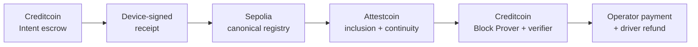

# ChargeProof deck

Slide-ready 10-slide source. Suggested visual language: deep navy, electric cyan, energy-lime,
technical grid, restrained motion, no generic crypto imagery.

---

## 1 — ChargeProof

**Trustless cross-chain EV charging settlement**

A station gets paid only when a cryptographically verified cross-chain charging receipt matches the
driver's escrowed intent.

Footer: BUIDL CTC 2026 Fall · DePIN

Visual: one energy pulse moving from a car/charger glyph through Sepolia and Attestcoin to Creditcoin
escrow.

---

## 2 — EV charging has a settlement gap

- Drivers, charge point operators, roaming providers, and payment systems hold fragmented records.
- A relayer assertion is not proof; a transaction on chain A cannot directly release escrow on chain B.
- Operators need prompt, auditable payment. Drivers need bounded authorization and automatic refunds.

Bottom line: **shared settlement needs authenticated usage evidence, not another reconciliation file.**

---

## 3 — Blockchain alone is not cross-chain verification

```text
Sepolia transaction  --X-->  Creditcoin escrow
                     no native read path
```

- A source receipt can be real, but Creditcoin needs cryptographic evidence of that exact transaction.
- Transaction inclusion alone is also insufficient: destination business rules must still be checked.
- Generic bridges or privileged relayers would replace one reconciliation trust assumption with another.

---

## 4 — One evidence-bound payment

1. Driver escrows maximum MockUSDC on Creditcoin.
2. Virtual charger meters energy and signs a deterministic EIP-712 receipt.
3. Driver anchors it in the canonical Sepolia registry.
4. Attestcoin proves the exact successful transaction to Creditcoin.
5. ChargeProof pays the final amount and credits unused escrow back.

Hero equation: `operator payment = ceil(energyWh × tariff / 1000) ≤ max escrow`

---

## 5 — Architecture



Four custom contracts, one resumable worker, one evidence-first dashboard. No bridge custody, token,
DAO, proxy, or decorative AI layer.

---

## 6 — Live end-to-end evidence

| Evidence                  | Explorer result                               |
| ------------------------- | --------------------------------------------- |
| Funded Creditcoin intent  | `0xb9e39a…f871` · success                     |
| Device receipt on Sepolia | `0x5c7eed…0938` · block 11,539,874            |
| Attestcoin proof          | 2,336 bytes · 7 siblings · 7 continuity roots |
| Creditcoin settlement     | `0xc7ad38…514b` · 1.47 / 3.53 MockUSDC        |
| Replayed proof            | `0xb9155e…daff` · mined revert                |

Gate 1 official-protocol spike evidence belongs in speaker notes, not as a custom ChargeProof claim.

---

## 7 — Attestcoin is indispensable

- SDK: `ProofBuilder.getProof` for Sepolia chain key `1`.
- Proof: authenticated EVM V1 transaction bytes + Merkle inclusion + continuity roots.
- Target: native Block Prover `verifyAndEmit` on Creditcoin.
- Without Attestcoin, the escrow has no authenticated Sepolia input and settlement cannot execute.

Destination defense in depth: receipt status · source chain · contract · selector · sender · EIP-712
device · intent · price · expiry · three replay domains.

---

## 8 — Security is a product feature

| Boundary    | Guarantee                                                                   |
| ----------- | --------------------------------------------------------------------------- |
| Physical    | Authorized device signature for MVP; not proof of electricity by Attestcoin |
| Source      | Driver call and successful canonical contract execution                     |
| Cross-chain | Attestcoin inclusion and continuity verification                            |
| Destination | Full semantic validation before escrow state change                         |
| Payment     | Pull credits isolate transfers; terminal states conserve escrow             |

Tests cover tampering, wrong chain/source/selector/sender/station, bad signer, expiry, overcharge,
malformed proof, replay, refund transitions, authorization, and accounting.

---

## 9 — From EV pilot to DePIN rail

**Next:** secure-element keys + OCPP/OCPI + one physical pilot + audit.<br>
**Then:** interoperable roaming receipts, stable payment asset, operator SDK.<br>
**Expand:** solar microgrids, telecom hotspots, battery swapping, and other metered services.

CEIP candidate: a reusable, versioned Creditcoin settlement interface for authenticated external-chain
meter receipts. Fast-track consideration is an opportunity, not guaranteed investment.

---

## 10 — ChargeProof closes the loop

**Metered service → authenticated transaction → bounded payment**

- Original DePIN vertical slice
- Attestcoin at the center, not in the margins
- Explorer-verifiable and replay-safe
- Honest path from simulator to real infrastructure

Team: `[NAME — ROLE]`<br>
GitHub: `github.com/tang-vu/ChargeProof` · Demo: `chargeproof-plum.vercel.app`
